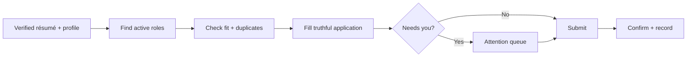

<div align="center">

# 💼 Job Application Agent

### Find better roles, apply with verified facts, and learn from outcomes.

[](https://github.com/vaibhavarora14/job-application-agent/actions/workflows/validate.yml)
[](https://www.npmjs.com/package/job-application-agent)
[](LICENSE)
[](job-application-agent/SKILL.md)

[Get started](#-get-started) · [Safety](#-safety) · [Privacy](#-privacy) · [Dashboard](https://job-application-agent-telemetry.varora1406.workers.dev/) · [Security](SECURITY.md)

</div>

---

Job Application Agent is an [Agent Skill](https://agentskills.io/specification) that helps a coding agent discover, evaluate, complete, and track your own job applications. It uses one verified résumé, checks eligibility and duplicates, and records only confirmed submissions.

## 🚀 Get started

Install it:

```bash
npx job-application-agent@latest install
```

Then tell your coding agent:

```text
Use job-application-agent to onboard my résumé and job preferences.
```

After onboarding, use natural commands:

```text
search jobs
list discovery sources for India and global remote engineering
apply https://company.example/jobs/123
apply all relevant jobs from this thread: <URL>
run a round of 10
show attention queue
record outcome Company — Senior Engineer — interview
```

Requires Node.js 20 or newer and a browser-capable coding agent.

On Linux, profile storage uses the Secret Service via the `secret-tool` CLI. Install it with `sudo apt-get install libsecret-tools` (Debian/Ubuntu) or the equivalent package manager command for your distribution.

Unlike macOS Keychain or Windows Credential Manager, the Linux Secret Service has no always-running system daemon: a keyring daemon (GNOME Keyring, KWallet, or similar) must be running in the user session for `secret-tool` to store or read the profile. On a desktop login this is normally already the case; on headless servers, containers, or SSH-only sessions, start one explicitly (e.g. `gnome-keyring-daemon --unlock --components=secrets`) before first use.

### Laptop apply loop (this branch)

The `cloud/` app on this branch runs the apply loop on your machine: discover → assess → fill → submit, with a page at `http://127.0.0.1:8787`.

```bash
cd cloud && npm install && npx playwright install chromium
npm run local
```

Open the page, import your existing skill profile, start a round of 10. Details: [`cloud/README.md`](cloud/README.md).

## ✨ What it does

| Stage | Behavior |
|---|---|
| **Discover** | Searches a shared, versioned catalog of direct careers, ATS platforms, networks, feeds, and job boards, then verifies every lead at the employer. |
| **Qualify** | Checks seniority, skills, location, authorization, compensation, and posting status. |
| **Apply** | Fills forms and uploads one canonical résumé using verified facts only. |
| **Track** | Deduplicates applications and records only visible submission confirmations. |
| **Improve** | Reviews outcomes and proposes targeting changes without rewriting candidate facts. |

## 🤖 Choose your autonomy level

- **`review-each`** — review every completed application before submission.
- **`routine-auto`** — allow routine submissions while keeping sensitive and judgment-heavy steps with you.

For durable autonomy across resumable or scheduled runs:

```bash
echo '{"mode":"routine-auto"}' | node ~/.agents/skills/job-application-agent/scripts/job-application.mjs autonomy grant --stdin
```

Check or revoke it at any time:

```bash
node ~/.agents/skills/job-application-agent/scripts/job-application.mjs autonomy status
node ~/.agents/skills/job-application-agent/scripts/job-application.mjs autonomy revoke
```

## 🛡️ Safety

The agent pauses for:

- passwords, SSO, MFA, and CAPTCHA;
- legal attestations and government identifiers;
- demographic or voluntary self-identification questions;
- unclear work authorization, sponsorship, location, or compensation;
- claims that cannot be verified from your profile or résumé;
- browser or operating-system permission prompts.

It never reads browser cookies or session files, bypasses access controls, or counts a filled form as a submission.

## 🧭 How it works



The bundled CLI handles private profile storage, résumé import, scoring, duplicate checks, resumable rounds, attention queues, and application/outcome ledgers. The coding agent handles discovery and browser interaction under the rules in [`SKILL.md`](job-application-agent/SKILL.md).

Discovery combines the reviewed [`SOURCES.json`](job-application-agent/references/SOURCES.json) catalog with an anonymous community registry. Every confirmed application automatically contributes its canonical public job URL, company, role, application channel, and provider; prior confirmed ledger entries backfill during later commands after a one-command disclosure grace period. Jobs, repeatable boards, and feeds are logged pending and become visible in the public dashboard or CLI only after maintainer review. Disable both forms of community sharing independently from analytics with `sources sharing disable`.

## 🔐 Privacy

| Data | Where it stays |
|---|---|
| Profile | macOS Keychain, Windows Credential Manager, or Linux Secret Service (libsecret) |
| Résumé and ledgers | Owner-only local state directory |
| Browser login | Existing browser session |
| Community-sharing preference and delivery receipts | Owner-only local state directory |
| Skill code | Version-controlled installation directory |

Candidate data, résumés, application history, credentials, and browser sessions are never committed to this repository.

Anonymous structured analytics are enabled by default to improve the agent. They may include job and workflow categories, but never candidate identity, résumé content, prompts, answers, browser data, IP addresses, or raw errors.

Anonymous community sharing is also enabled by default, separately from analytics. Confirmed applications share only a canonical public job URL, company, role, application channel, optional coarse discovery source, and derived provider URL—never candidate identity, answers, résumé, score, referral parameters, or submission timestamp. Repeatable discovery surfaces share their bounded catalog metadata through a maintainer-review queue. The registry stores no raw installation IDs; record-scoped contributor hashes are used only for deduplication and counts, never as identity or publication authority.

```bash
node ~/.agents/skills/job-application-agent/scripts/job-application.mjs telemetry status
node ~/.agents/skills/job-application-agent/scripts/job-application.mjs telemetry disable
node ~/.agents/skills/job-application-agent/scripts/job-application.mjs sources sharing status
node ~/.agents/skills/job-application-agent/scripts/job-application.mjs sources sharing disable
node ~/.agents/skills/job-application-agent/scripts/job-application.mjs sources jobs
```

See [`ANALYTICS.md`](job-application-agent/references/ANALYTICS.md) for the event contract and retention policy, or view the [public aggregate dashboard](https://job-application-agent-telemetry.varora1406.workers.dev/).

<details>
<summary><strong>Installation and update details</strong></summary>

The installer places the skill at `~/.agents/skills/job-application-agent` and enables automatic updates by default. Compatible vendor skill directories are also supported when they already exist.

```bash
npx job-application-agent@latest status
npx job-application-agent@latest update
npx job-application-agent@latest updates disable
npx job-application-agent@latest updates enable
```

Updates are staged and validated before replacement. Private candidate state lives outside the replaceable skill directory.

</details>

## 🧰 Develop

```bash
npm test
```

GitHub Actions validates the skill and runs the same test suite on every pull request. See [`CONTRIBUTING.md`](CONTRIBUTING.md) for the full local verification and review contract. To try the workflow without installing, paste [`SHARE_PROMPT.md`](SHARE_PROMPT.md) into a new agent chat.

## ⚖️ Responsible use

Use this project only for your own job search. It does not guarantee interviews, offers, eligibility, or application accuracy. Never use it to impersonate another person, bypass CAPTCHA, evade access controls, or make deceptive claims.

Report privacy or security issues through the process in [`SECURITY.md`](SECURITY.md). Do not open a public issue containing personal data or application records.

Released under the [MIT License](LICENSE).
