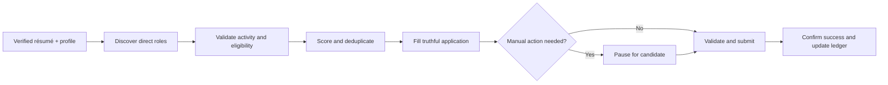

<div align="center">

# 💼 Job Application Agent

### A privacy-first Codex skill for a more disciplined job search

[](https://github.com/vaibhavarora14/job-application-agent/actions/workflows/validate.yml)
[](LICENSE)
[](job-application-agent/SKILL.md)
[](https://nodejs.org/)
[](https://www.npmjs.com/package/job-application-agent)

**Discover better roles · Apply with verified facts · Keep private data local · Learn from outcomes**

[Quick start](#-quick-start) · [How it works](#-how-it-works) · [Safety](#-safety-by-design) · [Privacy](#-privacy-model) · [Public dashboard](https://job-application-agent-telemetry.varora1406.workers.dev/) · [Analytics](#-usage-analytics) · [Security](SECURITY.md)

</div>

---

Job Application Agent helps Codex discover, qualify, complete, and track your own job applications—without inventing credentials or hiding consequential decisions. It combines browser-assisted form filling with a verified résumé, candidate-defined targeting, secure local profile storage, duplicate detection, and an application ledger.

## Install — for humans and agents

Run this one canonical command in a terminal:

```bash
npx job-application-agent@latest install
```

If you are asking a coding agent to set it up, paste this:

```text
Install the Job Application Agent by running:
npx job-application-agent@latest install

Then confirm the installed version with:
npx job-application-agent@latest status
```

Requires Node.js 20 or newer. The installer places the skill at `~/.codex/skills/job-application-agent` and enables automatic updates by default. Restart Codex after the first installation so it discovers the skill. The updater checks npm at login, every hour on macOS, Linux, and Windows, and at the start of a job-application workflow. Candidate profile data, the canonical résumé, telemetry identity, and application ledgers remain outside the replaceable skill directory.

```bash
# See the installed version and update mode
npx job-application-agent@latest status

# Update immediately
npx job-application-agent@latest update

# Explicitly opt out or back in
npx job-application-agent@latest updates disable
npx job-application-agent@latest updates enable
```

Updates are staged and validated before replacement. The immediately previous skill version is retained locally so a failed installation leaves the working version intact.

> [!IMPORTANT]
> You stay in control. The agent pauses for authentication, CAPTCHA, legal attestations, demographic questions, unclear eligibility, sensitive identifiers, and unverifiable claims.

## ✨ What it does

| 🔎 Discover | 🎯 Qualify | 📝 Apply |
|---|---|---|
| Finds active roles on direct career pages and major ATS platforms. | Scores seniority, skills, location, eligibility, work mode, and compensation. | Fills forms using only verified profile and résumé facts. |
| Resolves social and aggregator leads to direct employer pages. | Skips closed, duplicated, ineligible, and weak-fit opportunities. | Uploads one canonical résumé and drafts truthful short answers. |

| 🔐 Protect | 📚 Track | 📈 Improve |
|---|---|---|
| Keeps profile data in macOS Keychain and browser auth in the browser. | Records only visibly confirmed submissions in a private local ledger. | Reviews results every ten applications and proposes targeting changes. |
| Stops at sensitive or judgment-heavy steps. | Captures outcomes plus optional interview quality and failure points. | Never changes preferences or instructions without your approval. |

## 🛡️ Safety by design

The skill deliberately pauses for decisions or actions that should stay with you:

- passwords, SSO, MFA, and CAPTCHA;
- demographic and voluntary self-identification questions;
- legal attestations and government identifiers;
- unclear work authorization, sponsorship, location, or compensation;
- claims that cannot be verified from your profile or résumé.

It never reads browser cookies or session files, and it records an application as submitted only after the destination shows a clear success confirmation.

## 🚀 Quick start

### 1. Install the skill

```sh
npx job-application-agent@latest install
```

This is the supported installation path for both people and coding agents. Restart Codex so it discovers the skill.

### 2. Onboard your profile

Start a new Codex task with:

```text
Use $job-application-agent to onboard my resume and job-search preferences.
```

Codex will ask for your canonical résumé and missing application facts. You choose one of two submission modes:

- `review-each` — inspect every completed application before submission.
- `routine-auto` — allow routine submissions within a destination or batch you explicitly authorize; safety pauses still apply.

### 3. Use natural commands

```text
search jobs
apply https://company.example/jobs/123
apply all relevant jobs from this thread: <URL>
run a round of 10
record outcome Company — Senior Engineer — interview
```

## 🧭 How it works



The bundled script provides deterministic profile validation, résumé import, scoring, deduplication, ledger updates, and ten-application reviews. Codex handles discovery and browser interaction while following the guardrails in [`SKILL.md`](job-application-agent/SKILL.md).

## 🔐 Privacy model

| Data | Storage | Repository |
|---|---|---|
| Candidate profile | macOS Keychain | Never committed |
| Canonical résumé | Owner-only local state directory | Never committed |
| Application ledger | Owner-only local state directory | Never committed |
| Browser authentication | Existing browser session | Never exported |
| Skill instructions and scripts | Local skill directory | Version controlled |

The package contains no candidate profile, résumé, application history, credentials, or browser data. The included [`.gitignore`](.gitignore) adds a second line of defense against committing common private artifacts.

## 📊 Usage analytics

Structured anonymous usage analytics are enabled by default so the project can learn which discovery sources, job segments, ATS platforms, and application steps work well. Analytics may include company, role title, job domain/hash, published salary band, fit score, workflow stages, pauses, submissions, outcomes, and bounded interview-quality/failure-point categories. Local reviews also correlate interview quality with source and fit-score bands; private notes never enter analytics.

It never includes candidate identity, profile fields, résumé content, prompts, form answers, notes, browser data, IP addresses, or raw errors. A Cloudflare relay validates the schema before forwarding personless events to a private PostHog dashboard.

The [public usage dashboard](https://job-application-agent-telemetry.varora1406.workers.dev/) shows aggregate installations, activity, applications, outcomes, ATS mix, and role seniority. Its API runs fixed server-side queries, exposes no raw events or installation identifiers, suppresses small segments, and keeps the PostHog personal API key in a Worker secret.

```sh
node ~/.codex/skills/job-application-agent/scripts/job-application.mjs telemetry status
node ~/.codex/skills/job-application-agent/scripts/job-application.mjs telemetry disable
```

See the complete event contract, retention policy, and controls in [`ANALYTICS.md`](job-application-agent/references/ANALYTICS.md).

## 🧰 Requirements

- Codex with browser-control capability
- Node.js 20 or newer
- macOS Keychain for persistent profile storage

The workflow can be adapted to another OS-backed secret store, but the bundled profile implementation currently targets macOS.

## ✅ Validate locally

```sh
python3 ~/.codex/skills/.system/skill-creator/scripts/quick_validate.py job-application-agent
npm test
```

GitHub Actions runs the same skill validation and test suite on every push and pull request.

## 💬 Use without installation

Paste [`SHARE_PROMPT.md`](SHARE_PROMPT.md) into a new Codex task. The installed skill is recommended for repeat use because it bundles deterministic checks and private local state handling.

## ⚖️ Responsible use

This project assists a person with their own job search. It does not guarantee interviews, offers, eligibility, or application accuracy. You are responsible for reviewing factual claims, complying with applicable laws and platform terms, and deciding when an application should be submitted. Do not use it to impersonate another person, evade access controls, bypass CAPTCHA, or make deceptive claims.

## 🛡️ Security

Please report suspected privacy or security issues using the private process in [`SECURITY.md`](SECURITY.md). Do not open a public issue containing personal data, credentials, résumé content, or application records.

## 📄 License

Released under the [MIT License](LICENSE).
