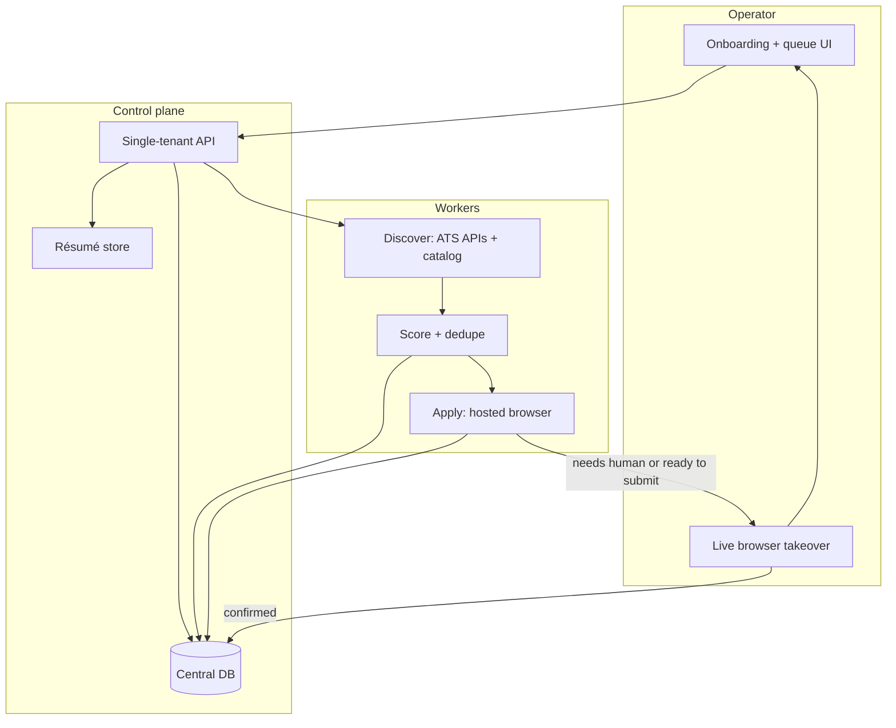
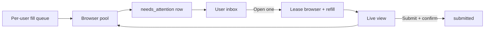

# Cloud apply MVP

Personal-first plan for hosted discovery, application filling, human takeover, and a central ledger. Auth, multi-tenant accounts, and paid activation stay out of this MVP.

The public site already promises cloud access on 18 September 2026: scheduled discovery, resumable runs, and decision notifications. The local Agent Skill already has the runbook. This document is the shortest path from “works in a coding-agent browser on my laptop” to “I can start a round from a hosted box and finish the hard steps myself.”

## Goal

**Keep a truthful search moving while the candidate is away. Pull them in only for real decisions. Record a submission only when the employer visibly confirms it.**

That is the same promise as the site (“Set the goal. Keep the search moving.”) and the local skill. Cloud does not get a different goal. It gets a hosted loop that can survive the candidate closing the laptop.

Three things must stay true at every horizon:

1. **Facts.** Fills use the verified profile and one canonical résumé. Nothing is invented.
2. **Judgment.** Login, MFA, CAPTCHA, legal, demographics, government IDs, unclear authorization/compensation, and Submit (until a channel earns auto-submit) stay with the candidate.
3. **Ledger.** `submitted` means a visible confirmation. Volume, open tabs, and “probably sent” do not count.

### Why the earlier wording was weak

- It described a **mechanism** (“take over that same browser”) instead of an outcome. Warm tabs do not scale and are not the point.
- It optimized for **one operator’s session**, so 100 users × 100 pending submits looked like a new product.
- It said success is “not volume” but did not say what **is** success, so the September launch and the 10,000-row inbox had no finish line.
- It mixed **dogfood**, **founding access**, and **multi-tenant load** into one list.

### Horizons

| Horizon | Who | Done when |
|---|---|---|
| **H0 — Personal dogfood** | You, one new Fly app (not Paisewise) | One Greenhouse (then Lever/Ashby) loop: onboard → discover via API → assess → fill → **just-in-time** live view → you submit → ledger row exists only after the thank-you page. A killed session can be refilled. |
| **H1 — Founding cloud** | Paying users, after H0 | They set boundaries once, get a scheduled round, and an inbox of pauses. Auth and isolation exist. Same ledger rules. Still no auto-submit. |
| **H2 — Many inboxes** | ~100 users, ~100 `needs_attention` each | Those 10,000 items are inbox rows. Browser pool ≈ in-flight fills + people in live view. One Chrome context per user. “Open” means acquire → refill → hand off → release. |

H0 is what we build first. H1 is the 18 September offer. H2 is a capacity and tenancy problem if H0 APIs already treat a session as a lease.

### What we measure (and what we do not)

Count:

- Confirmed unique submissions (visible employer/ATS success)
- Attention items by blocker, and time from “ready” to “opened”
- Fills that had to be refilled after a dead session
- False or skipped confirmations (should be ~0)

Do not count: forms filled but not confirmed, tabs held open, applications per hour, or “autoEligible” as a submit.

### Non-goals (all horizons)

- Application volume as a success metric
- LinkedIn Easy Apply, X, or other session-gated social apply
- Auto-submit before a channel is boringly reliable
- Sharing the Paisewise Machine
- A second scoring system or a second meaning of `submitted`

## What we already have

Do not rebuild these. Host them.

| Local capability | Where it lives today | Cloud reuse |
|---|---|---|
| Required profile + targeting | `profile set` / `SCHEMAS.md` | Same JSON, stored in the central DB instead of OS keychain |
| Canonical résumé | `resume import` / `resume path` | Object storage + absolute path inside the browser host |
| Fit scoring and gates | `score --stdin` | Call the existing CLI as a library or subprocess |
| Duplicate + company-reapply rules | `ledger check` / `ledger add` | Same IDs and overrides, persisted as tables |
| Attention / friction queues | `attention.*` / `friction.*` | Same enums; attention items now carry a live-session URL |
| Discovery catalog | `SOURCES.json` + community jobs | Same packaged sources; ATS board APIs add structured search |
| Safety hard stops | `SKILL.md` / `AUTONOMY.md` | Unchanged. The cloud runtime must still stop. |
| Landing, D1, founding checkout | `site/` | Later activation. Not required to dogfood. |

The local product already encodes the product contract: fill only verified facts, record `submitted` only after visible confirmation, queue blockers instead of inventing answers, and never inspect cookies or session files from the operator’s own browser.

## Recommended shape



Three layers, one tenant:

- **Control plane.** Profile, résumé, jobs, assessments, applications, attention, answers, rounds. SQLite is enough for personal dogfood. Postgres or D1 later.
- **Discovery.** Prefer HTTP APIs. Use a browser only when the source has no structured feed.
- **Apply.** A real Chromium session. The agent fills. The operator submits when the form is complete or a hard stop fires.

Auth is a later gate in front of the same API. For MVP, bind the process to a machine you control and do not expose it publicly.

## The application loop

1. **Onboard.** Collect every field the current CLI already requires, plus the extras that ATS forms ask every week. Upload one canonical résumé. Nothing is inferred.
2. **Discover.** Pull public ATS boards and the existing catalog. Normalize to `{company, role, url, employerJobId, applicationChannel, discoverySource}`.
3. **Qualify.** Reuse `score`. Keep `exclude` / `ask` / `skip` / `review` and `autoEligible`. For MVP, `autoEligible` means “safe to fill,” not “safe to submit.”
4. **Fill.** Open the direct apply URL in the hosted browser. Fill profile facts, upload the résumé, draft narrative answers from `APPLICATION_GUIDANCE.md`.
5. **Pause.** If a hard stop fires *or* the form is ready to submit, write an attention item and keep the tab alive.
6. **Handoff.** The operator opens a live view of that same tab, finishes login / CAPTCHA / legal / judgment, and clicks Submit.
7. **Confirm.** Only after a visible success page does the system write `submitted`. No confirmation, no ledger row.
8. **Continue.** Other jobs keep moving while one tab waits for you.

This is stricter than local `routine-auto`. The first hosted version should never click Submit. That is the cheapest way to learn which sites we can actually finish.

## Details to collect

Ask the known set up front. When a form asks something new, queue it, keep the tab, and do not invent an answer.

### Ask during onboarding

Required today (`REQUIRED_PROFILE` plus résumé):

- Identity: name, email, phone, location
- Work authorization in the candidate’s own words
- Target role families, seniority, years of experience
- Target locations and work modes
- Submission mode (`review-each` for the cloud MVP)
- Score floors: `autoSubmitMinScore`, `manualReviewMinScore`, `minMustHaveCoverage`
- Canonical résumé (PDF)

Collect on the same screen even though some are optional in the CLI. They appear on almost every ATS form:

- LinkedIn, GitHub, portfolio
- Availability / notice period
- Current compensation and target compensation
- Compensation floor (amount, currency, annual)
- Skills, industries
- Excluded companies and excluded locations
- Citizenship / visa status as free text (“Indian citizen, no US sponsorship needed” / “Need H-1B transfer”) — stored as `workAuthorization`, never as a government ID
- Preferred name, pronouns only if the candidate volunteers them
- How they want to hear about pauses (email is enough for MVP)

### Ask when a form requires it

Keep a `candidate_answers` table keyed by question fingerprint (`normalized label + channel`). Reuse an answer the next time the same question appears.

Typical mid-run prompts:

- Salary expectation on this requisition
- “Are you authorized to work in X without sponsorship?”
- “Have you previously applied / been employed here?”
- Cover-letter or “why this company” (draft from guidance, confirm if `review-each`)
- Start date, willingness to relocate, travel percentage
- How they heard about the role
- Website / additional links not in the profile

Never store, and never ask the agent to answer:

- Passwords, SSO, MFA codes, CAPTCHA solutions
- Government IDs, SSN / Aadhaar / passport numbers
- Demographic or voluntary self-identification
- Legal attestations the candidate has not already approved as boilerplate

Those stay in the live browser, typed by the operator.

## Discovery: APIs first

Most of the search problem does not need a browser.

| Source | What we can do without a browser | Apply path |
|---|---|---|
| Greenhouse board | `GET https://boards-api.greenhouse.io/v1/boards/{token}/jobs?content=true` | Browser. The Job Board *submit* POST needs the **employer’s** API key, which we do not have. |
| Lever | `GET https://api.lever.co/v0/postings/{slug}?mode=json` | Browser on `hostedUrl` |
| Ashby | `GET https://api.ashbyhq.com/posting-api/job-board/{slug}` | Browser on `jobUrl` / `applyUrl` |
| Workable / SmartRecruiters / Recruitee | Public board / widget JSON | Browser |
| Workday | Public CXS search POST on some tenants | Browser. High friction; not an MVP target. |
| Packaged catalog | `SOURCES.json` + `sources jobs` | Resolve to the employer / ATS page, then treat as above |
| Community jobs | Existing maintainer-reviewed feed | Same |
| Hacker News / company career pages | HTML or browser | Only after ATS boards are producing enough leads |
| LinkedIn, X, YC Work at a Startup | Session required | Out of MVP. Needs a persistent logged-in profile and is ToS-sensitive. |

MVP discovery is a watched list of company board slugs (Greenhouse / Lever / Ashby) plus the existing catalog. You seed 30–80 companies you actually want. The worker polls, normalizes, scores, and inserts new `jobs` rows.

That is enough to dogfood apply. Broader search is a later gap, not a blocker.

### Why ATS submit APIs do not bypass the browser

Greenhouse documents `POST /v1/boards/{board_token}/jobs/{id}`. It is built for a company hosting its own careers site. It authenticates with that company’s Job Board API key. Lever and Ashby application writes are the same class of problem: employer-side, not candidate-side.

So: **APIs for search and form-schema hints. Browser for apply.** If a future employer-hosted apply widget is truly keyless and ToS-clean, add it as a channel adapter. Do not plan the MVP around it.

Greenhouse job detail responses do include the `questions` array. Use that to pre-flight missing answers *before* opening a browser.

## Browser options

The product need is narrow: a Chromium we drive with Playwright, a way to upload the résumé by path, and a live view the operator can take over without us reading their cookies.

| Option | Fit | Strength | Main limit |
|---|---|---|---|
| **Playwright on a small VM you control** (Fly, Hetzner, a home box) + noVNC or Chrome remote debugging | Best personal MVP | Full control, cheap, headed, easy file upload, session can sit for hours | You operate the machine; no productized handoff UI |
| **Steel** (self-host Docker, or Steel Cloud) | Best next step if the VM works | Open-source browser API, Playwright/CDP, Profiles, Live View, 24h sessions on cloud | Another vendor or another container to run |
| **Cloudflare Browser Run** (formerly Browser Rendering) | Best long-term stack fit | Site already on Workers/D1; Playwright; **Live View + `Cloudflare.handoff`** with Done/Failed; Durable Objects for session reuse | Traffic is **always labeled bot**; free tier is 10 browser-minutes/day; idle timeout 60s (max 10 min) unless kept alive |
| **Browserbase + Stagehand** | Strong hosted alternative | Live View, Contexts, uploads, observability, stealth options | Cost; another vendor; less overlap with the current Cloudflare site |
| **Kernel** | Cost / long session | Per-second billing, 72h sessions, managed auth, live view | Newer; less overlap with current stack |
| **Coding-agent browser on a cloud VM** | Emergency fallback | Same workflow as today | Not a product; session dies with the chat |

### Recommendation

**Personal MVP: a new Fly app, not the Paisewise Machine.** Paisewise (Founder's Office / payroll) stays on its current Fly Machine. The apply loop gets a second app in the same Fly org, with its own Machine, volume, and sleep settings. Do not share the Paisewise process, volume, or public hostname.

Target size: ≥2 GB RAM, 2 shared CPUs, a 10 GB volume for Chrome profile / SQLite / résumé / ledger, `auto_stop` off while a round is running. Reach it with `fly proxy` or WireGuard, not a public `.fly.dev` URL.

Playwright on that Machine: one persistent Chromium user-data dir, and a VNC / Live View tab you open when attention fires. Pair it with SQLite and the existing `score` / `ledger` CLI.

**If the first week shows takeover is the painful part,** switch the browser host to Steel Cloud or Browserbase. Keep the same control plane.

**If dogfood shows Cloudflare Browser Run can complete Greenhouse/Lever/Ashby fills** despite the bot label, prefer it for the public product. It is the only option that already matches the site’s runtime and has a first-party handoff protocol (`Cloudflare.getLiveView` + `Cloudflare.handoff` + `Cloudflare.handoffComplete`, timeout up to 30 minutes). Keep a heartbeat so idle sessions survive past 10 minutes.

Do not pick the public-product browser until you have applied to a handful of real boards from a hosted session. Bot detection is the decision, not the brochure.

## Human intervention

Local attention already names the stops. Cloud adds a live tab.

| Blocker | Agent does | Operator does in live view |
|---|---|---|
| Authentication / SSO / MFA | Stop, keep tab | Sign in. Agent never sees the password. |
| CAPTCHA | Stop, keep tab | Solve it. Do not add a CAPTCHA-solving vendor. |
| Legal attestation | Stop | Read and accept, or reject the job |
| Demographic questions | Leave blank, stop | Skip or fill. Agent does not answer. |
| Government ID | Stop | Type it only in the page, or abandon |
| Unclear authorization / compensation | Ask in the UI, then resume | Confirm the stored answer |
| Unverifiable claim | Stop | Provide evidence or skip the job |
| Judgment / video | Stop | Write or record |
| Ready to submit | Verify fields + résumé filename | Click Submit, wait for the success page |
| Site error | Friction row, retry later | Optional live inspect |

Handoff contract for an attention item:

- `applicationId`, canonical `url`, `stage`, `blocker`, `requiredActions` (existing enums)
- `sessionId` and a short-lived `liveViewUrl`
- `instructions` (“Review the filled form. If it is truthful, click Submit and wait for the thank-you page.”)
- `expiresAt`

The agent watches for either a structured handoff completion (Cloudflare / Steel) or a visible confirmation selector. Only then `ledger add`.

If the session dies before you arrive, reopen the URL, refill from the profile, and recreate the attention item. Do not restore cookies from a dump.

## Central database

Personal MVP can be SQLite. The schema should match the local documents so a later hosted product and the OSS CLI stay compatible.

```text
profiles            one row. Same fields as profile set.
resumes             bytes or object-store key, sha256, original filename.
discovery_sources   packaged + watched ATS slugs.
jobs                canonical url, employer_job_id, company, role, channel, raw snapshot.
assessments         score result + must-haves + gates. Private evidence stays here.
applications        ledger rows. status: queued | filling | needs_attention | submitted | abandoned.
answers             reusable question fingerprint → candidate text.
attention           existing attention event + session_id + live_view_url.
rounds              requested count, counts, timestamps.
outcomes            same as ledger outcome.
browser_sessions    provider, session_id, status, last_heartbeat, current_application_id.
```

Rules carried over unchanged:

- Applications are append-mostly. Do not rewrite a `submitted` row.
- `submitted` requires a confirmation artifact (URL + excerpt or screenshot stored privately).
- Duplicate keys: ledger id, canonical URL, employer job id.
- Company reapply: 15-day cooldown, explicit override phrase.
- No passwords, MFA, government IDs, demographic answers, or raw cookie jars in this database.

## Personal MVP build order

The sequenced tasks, acceptance checks, and first-commit order live in [docs/cloud-implementation-plan.md](./cloud-implementation-plan.md). This section is the short version.

Keep this small enough to run for yourself before any customer auth.

### 1. Control plane on one box

- SQLite (or local Postgres) with the tables above.
- Import path: `profile set` JSON + `resume import` PDF.
- Thin HTTP API or CLI: `onboard`, `round start`, `attention list`, `jobs list`, `ledger review`.
- No public DNS. Tailscale / SSH tunnel is enough.

### 2. Discovery worker

- Config file of `{channel, slug}` for Greenhouse / Lever / Ashby.
- Normalize, store, run `score --stdin`.
- Insert `review` jobs into a fill queue. Surface `ask` jobs as questions, not applications.

### 3. Apply worker

- Playwright against local Chromium with a dedicated user-data directory.
- Résumé upload via `setInputFiles` / file chooser (same as `BROWSER_UPLOADS.md`).
- Channel adapters in this order: Greenhouse hosted board, Lever hosted, Ashby hosted. Everything else is `other` and skipped.
- Never click the final Submit.

### 4. Takeover

- When the form is complete or a hard stop hits: start noVNC (or Steel/Browserbase live view) and write the attention row.
- You open the link, submit or unblock, mark done.
- Worker detects the confirmation page and records `submitted`.

### 5. Operator surface

A single page is enough:

- Profile completeness
- Fill queue and today’s round
- Open attention items with “Open live session”
- Submitted ledger
- A prompt for any mid-run missing answer

Email or a Telegram/ntfy ping when attention is non-empty.

### 6. Dogfood, then decide the hosted browser

Run one round of 10. Write down, per channel:

- Could we find it via API?
- Could we fill every required field?
- Did bot detection or login block us?
- Did you need to be in the tab to submit?
- Did confirmation detection work?

That log chooses Cloudflare Browser Run vs Steel vs Browserbase for the September product. Do not choose from this document alone.

## Scale: 100 users × 100 pending submits

That is **10,000 ledger rows**, not 10,000 open browsers. The personal Fly Machine will not do this. The control plane can, if we treat a browser as a short lease and the pending queue as data.

### What is actually concurrent

| Work | Count at that load | Needs a live browser? |
|---|---|---|
| Discovered / scored jobs | tens of thousands | No. HTTP + `scoreJob`. |
| Fill backlog (agent completing forms) | up to 10,000 in `queued` / `filling` | Yes, only while filling. One tab per in-flight fill. |
| Waiting for the user to submit | 10,000 in `needs_attention` | **No.** Persist the row. Do not hold Chromium. |
| User sitting in live view | maybe 5–30 at once | Yes. One tab per active handoff. |

A Chrome context is hundreds of MB. Holding 10,000 tabs would be terabytes of RAM. Holding **~20 fill workers + ~20 handoff workers** is a normal pool.

Pending-to-submit is an inbox. The already-planned refill path (“session died → reopen URL → refill from profile → new live view”) is the scale path, not an error path.



### Capacity sketch

Assumptions: Greenhouse-class fills, ~3–5 minutes each, users submit when they have time.

- **Fill:** 10,000 × 4 min ≈ 670 browser-hours. A pool of 20 fillers clears a full backlog in a bit over a day, then keeps up with daily discovery.
- **Handoff:** sized to *people in the tab now*, not pending count. 100 users with 100 ready items still only need ~10–30 browsers if they are not all clicking at once.
- **One Fly Machine (2–4 GB):** one user, one or two tabs. Fine for dogfood. Not this load.
- **This load:** a browser pool (more Fly Machines, or Steel / Browserbase / Kernel / Cloudflare Browser Run) behind the same `{launch, fill, handoff, heartbeat, close}` adapter. Postgres (or equivalent), not SQLite. One browser **context per user** — never a shared Chrome profile.

Discovery and scoring stay cheap. They are not the bottleneck.

### What the user sees

A person with 100 ready applications does not get 100 live tabs. They get a queue:

1. Open the inbox (ready to submit / login / legal / missing answer).
2. Click one. We lease a browser, refill, show live view.
3. They submit or unblock. We confirm, record, release the browser.
4. Optional “next ready” so they can walk the list.

That is still 100 human submits unless a channel later earns auto-submit. The product win at this scale is “every form is already true,” not “one click empties 100.” Auto-submit, if it ever lands, is per-channel after dogfood — not a way to skip the pool.

### Isolation and abuse

- Tenant boundary: profile, résumé, answers, ledger, attention, and browser context are per user.
- Same-user fills may reuse that user’s context (cookies they created). **Never** reuse it across users.
- Stagger fills. One Fly egress IP blasting 10,000 Greenhouse POSTs will look like a botnet. Per-user or small-pool proxies, plus rate limits per channel, become required.
- D1 is fine for founding checkout. 10,000 applications with JD snapshots and screenshots want Postgres + object storage.

### What we must not paint into a corner in the MVP

The single-user Fly box can keep a tab warm overnight. The APIs should still look like this so the pool can replace it:

- Applications are rows with `queued | filling | needs_attention | submitted | abandoned`.
- Attention items join to a *session id that may be null*.
- “Open live session” means *acquire, refill, hand off*, not *attach to a process that has been up for hours*.
- Browser vendor is behind the adapter.

If we do that on day one, 100 × 100 is an ops and tenancy problem, not a new agent.

## Path to the public cloud

Only after the personal loop works.

1. **Extract** scoring, ledger, attention, and source-normalization from the CLI into a package both the skill and the worker import. Do not fork the rules.
2. **Move** the control plane onto the existing Cloudflare site: D1 or Postgres, R2 for résumés, the Quiet Trust UI.
3. **Put** a browser adapter behind `{launch, fill, handoff, heartbeat, close}`. The rest of the app should not care which vendor is behind it.
4. **Add** auth and founding activation in front of that API. Paid access already exists; it currently activates nothing product-shaped.
5. **Schedule** discovery. Reuse rounds. Notify on attention.
6. **Keep** the same hard stops. `routine-auto` in the cloud still does not click Submit until dogfood says a channel is boringly reliable.

## Gaps the first personal run will hit

These are expected. Capture them as friction rows.

**Apply reliability**

- Cloudflare Browser Run (and many hosted browsers) are labeled as bots. Greenhouse is often fine; Workday, LinkedIn, and some Ashby/Cloudflare-protected career sites are not.
- Hosted apply pages are not one DOM. Greenhouse iFrames, Ashby multi-step, Lever custom questions, and “Apply with LinkedIn” overlays will each need a thin adapter.
- Résumé parsing on the ATS side overwrites truthful fields. The local runbook already says to restore them. The worker must do the same.
- Confirmation pages vary. Screenshot + URL + a conservative “thank you / application received” detector; if unsure, leave the row in `needs_attention`.

**Sessions and time**

- LinkedIn / YC / Workday SSO need a long-lived profile. Out of MVP, but the VM user-data dir is how we will learn whether persistence is even acceptable.
- Cloudflare idle cap (10 minutes) is too short for a human to notice a Slack ping and finish MFA. A heartbeat or a longer-lived vendor is required for handoff.
- A tab that waits overnight needs either a vendor with 24h+ sessions (Steel / Kernel) or a refill-on-reopen path.

**Product and policy**

- We will not have candidate-side submit APIs. Anyone claiming otherwise is using an employer key or unofficial scrape-and-POST.
- LinkedIn Easy Apply is a ToS and detection minefield. Do not include it in the first hosted offer.
- Storing a résumé and work-authorization text in a cloud DB is a privacy event the current local product avoided on purpose. The privacy page already says cloud access needs explicit controls before it accepts this data. Even for personal dogfood, encrypt at rest and keep the machine off the public internet.
- CAPTCHA-solving services are out of bounds. Human takeover is the product.
- Multi-tenant isolation, audit logs, and “delete my profile” are launch blockers, not MVP blockers — unless someone else can reach your instance.

**Operator experience**

- You will still do login, MFA, legal, and submit. The win is not “zero clicks.” It is “the form is already true when you arrive.”
- Mid-run questions need a faster loop than email. The first UI should let you answer and resume without losing the tab.
- Discovery quality depends on the company slug list. Garbage in, garbage out. Start from companies you would actually join.

## What this MVP will not do

- User accounts, OAuth, or founding-access gating
- Auto-submit
- LinkedIn Easy Apply, X, or other session-gated social apply
- Demographic answers, government IDs, or stored passwords
- Résumé rewriting or per-company résumé variants
- Guaranteed interviews or “apply to 100 jobs overnight”
- A second scoring system or a second ledger format

## Decision checklist

Use this when the personal run is done.

- [ ] Onboarding can represent a complete `profile set` plus résumé.
- [ ] Discovery from at least 20 ATS slugs produces scored, de-duplicated jobs.
- [ ] A Greenhouse or Lever application can be filled in a hosted browser from those facts.
- [ ] Attention items include a live URL; you can submit from that tab.
- [ ] `submitted` rows exist only after a visible confirmation.
- [ ] A killed session can be reopened and refilled without cookie export.
- [ ] Notes exist for bot detection, missing questions, and confirmation misses per channel.
- [ ] A browser adapter interface is clean enough to swap VM Playwright for Cloudflare / Steel / Browserbase.

If those are true, the September product is an isolation, auth, and vendor-hardening job — not a new agent.
